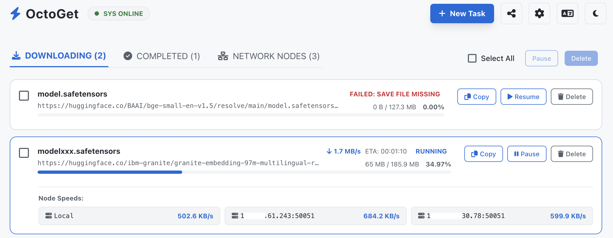
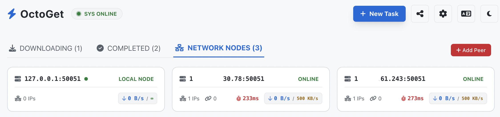
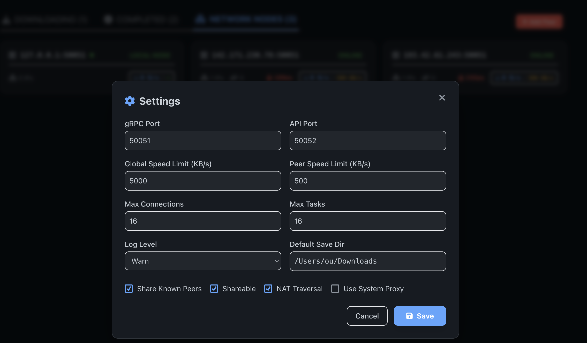

<!-- README.md -->
# OctoGet - Distributed Download Accelerator

[中文](README.zh.md)

OctoGet is a high-performance, distributed download accelerator written in Rust. 
It allows you to deploy multiple nodes across different servers and utilize 
their combined network bandwidth to accelerate file downloads.

- Scenario 1: If the local machine cannot access the target address, but a node can, it can download directly.

- Scenario 2: If local access to the target node is slow, it can accelerate downloads through multiple nodes.

## Features
- **Symmetric Architecture**: Every node can act as both a Downloader and a Worker.
- **Dynamic Load Balancing**: Uses fine-grained pieces to naturally balance load.
- **Smart  Optimal Routing**: Detects tail latency, measures peer speed, and dynamically routes traffic to the fastest nodes.
- **Auto-Registration**: Nodes can automatically share their bandwidth with configured peers.
- **Granular Security**: Independent token configuration for each peer node.

## Screenshots

### Download List Interface


### Nodes Interface  


### Settings Interface


## Build Instructions
Ensure you have Rust and Cargo installed.
```bash
cargo build --release
```
The compiled binaries will be available in the `target/` directory.

## Configuration (`config.toml`)
You can configure the node via a `config.toml` file.
```toml
grpc_port = 50051
api_port = 50052
record_dir = "./octoget_records"
my_token = "xx50051xx"
share_node = true
shareable = true
nat_traversal = true
max_connections = 16
global_speed_limit_kb = 5000
peer_speed_limit_kb = 500
log_level = "warn"

[[peers]]
address = "10.10.10.100:50051"
token = "xx9123xx"

```

## Running
```bash
# Run with config file
./octoget --config config.toml

# Or directly run `octoget`, it will automatically look for `config.toml` in the current directory
